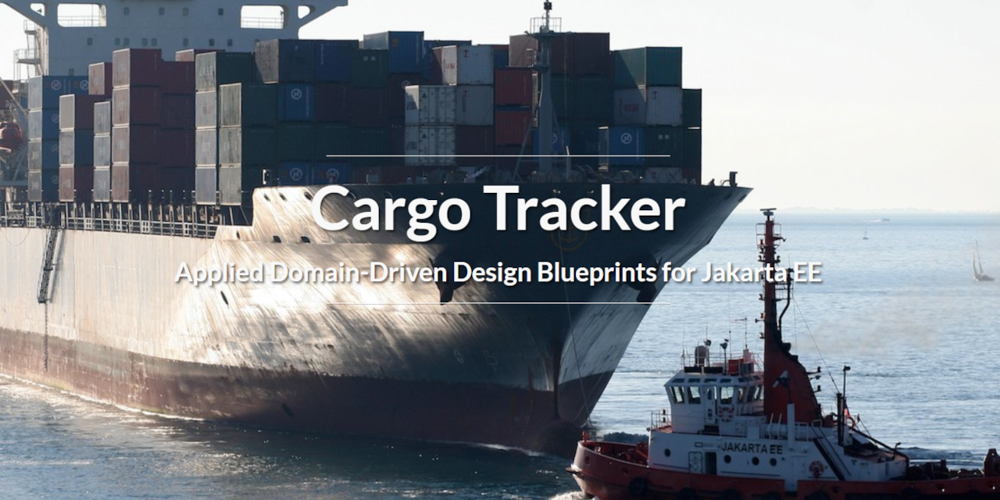

# Eclipse Cargo Tracker - Applied Domain-Driven Design Blueprints for Jakarta EE

The project demonstrates how you can develop applications with Jakarta EE using widely adopted architectural best practices like Domain-Driven 
Design (DDD). The project is directly based on the well known 
original [Java DDD sample application](http://dddsample.sourceforge.net) 
developed by DDD pioneer Eric Evans' company Domain Language and the Swedish 
software consulting company Citerus. The cargo example actually comes from 
Eric Evans' seminal book on DDD. The original application is written in Spring,
Hibernate and Jetty whereas the application is built on Jakarta EE.

The application is an end-to-end system for keeping track of shipping cargo. It 
has several interfaces described in the following sections.

For further details on the project, please visit: https://eclipse-ee4j.github.io/cargotracker/.

A slide deck introducing the
fundamentals of the project is available on the official Eclipse 
Foundation [Jakarta EE SlideShare account](https://www.slideshare.net/Jakarta_EE/applied-domaindriven-design-blueprints-for-jakarta-ee). A recording of the slide deck is available on the official [Jakarta EE YouTube account](https://www.youtube.com/watch?v=pKmmZd-3mhA).

 
## Getting Started

The [project website](https://eclipse-ee4j.github.io/cargotracker/) has detailed information on how to get started.

The simplest steps are the following (no IDE required):

* Get the project source code.
* Ensure you are running Java SE 8, Java SE 11 or Java SE 17.
* Make sure JAVA_HOME is set.
* As long as you have Maven set up properly, navigate to the project source root and 
  type: `mvn clean package cargo:run`
* Go to http://localhost:8080/cargo-tracker

To set up in Eclipse, follow these steps:

* Set up Java SE 8, Java SE 11 or Java SE 17, [Eclipse for Enterprise Java Developers](https://www.eclipse.org/downloads/packages/) and [Payara 5](https://www.payara.fish/downloads/). You will also need to set up [Payara Tools](https://marketplace.eclipse.org/content/payara-tools) in Eclipse.
* Import this code in Eclipse as a Maven project, 
  Eclipse will do the rest for you. Proceed with clean/building the application.
* After the project is built (which will take a while the very first time as Maven downloads dependencies), simply run it via Payara 5.

## Getting Started with Open Liberty

To set up the project with Open Liberty and Maven:

* Ensure you are running Java SE 8, Java SE 11, or Java SE 17 (IBM Semeru recommended with Open Liberty: https://developer.ibm.com/languages/java/semeru-runtimes/downloads/ -> select from the version dropdown menu.
* Make sure JAVA_HOME is set.
* Navigate to the cargotracker directory and develop the application with Liberty Maven Plugin: `mvn -P openliberty liberty:dev`.

You can safely ignore the shrinkwrap features warning and the AggregateObjectMapping nested foreign key warning, as these don’t affect the application functionality. 

* The application should start without any additional errors and you can view it at http://localhost:8080/cargo-tracker.

To set up the project with Open Liberty and Eclipse IDE: 

* Ensure that you have either Eclipse version 2022-03 or 2022-06. 
* Follow the instructions in the Github repository to install Liberty Tools for Eclipse. https://github.com/OpenLiberty/liberty-tools-eclipse/blob/main/docs/installation/installation.md
* Import the Cargo Tracker project via File -> Import -> “Existing Maven Projects” and follow the rest of the steps in the configuration wizard.
* Find the application on the Liberty dashboard through Liberty Tools.
* Right click the project name and start the application with parameters (the second start option): 
* Specify the Liberty profile by using ‘-Popenliberty’ and then starting the application by selecting ‘OK’.
* The application should start without any further issues beside the cosmetic warnings related to DB setup and message endpoint initialization. 
* You can view the app at http://localhost:8080/cargo-tracker.

NOTE: On Mac OS, if the ‘mvn’ command is not found by Eclipse, users must start Eclipse through a folder by navigating to their Eclipse version (for example, eclipse/jee-2022-06), right-clicking the Eclipse icon, then selecting “Show Package Contents”. Then, navigate to Contents -> MacOS and start Eclipse using the executable file found there. The Maven path should be resolved.

## Exploring the Application

After the application runs, it will be available at: 
http://localhost:8080/cargo-tracker/. Under the hood, the application uses a 
number of Jakarta EE features including Faces, CDI, Enterprise Beans, Persistence, REST, Batch, JSON Binding, Bean Validation and Messaging.

There are several web interfaces, REST interfaces and a file system scanning
interface. It's probably best to start exploring the interfaces in the rough
order below.

The tracking interface let's you track the status of cargo and is
intended for the general public. Try entering a tracking ID like ABC123 (the 
application is pre-populated with some sample data).

The administrative interface is intended for the shipping company that manages
cargo. The landing page of the interface is a dashboard providing an overall 
view of registered cargo. You can book cargo using the booking interface.
One cargo is booked, you can route it. When you initiate a routing request,
the system will determine routes that might work for the cargo. Once you select
a route, the cargo will be ready to process handling events at the port. You can
also change the destination for cargo if needed or track cargo.

The Handling Event Logging interface is intended for port personnel registering what 
happened to cargo. The interface is primarily intended for mobile devices, but
you can use it via a desktop browser. The interface is accessible at this URL: http://localhost:8080/cargo-tracker/event-logger/index.xhtml. For convenience, you
could use a mobile emulator instead of an actual mobile device. Generally speaking cargo
goes through these events:

* It's received at the origin location.
* It's loaded and unloaded onto voyages on it's itinerary.
* It's claimed at it's destination location.
* It may go through customs at arbitrary points.

While filling out the event registration form, it's best to have the itinerary 
handy. You can access the itinerary for registered cargo via the admin interface. The cargo handling is done via Messaging for scalability. While using the event logger, note that only the load and unload events require as associated voyage.

You should also explore the file system based bulk event registration interface. 
It reads files under /tmp/uploads. The files are just CSV files. A sample CSV
file is available under [src/test/sample/handling_events.csv](src/test/sample/handling_events.csv). The sample is already set up to match the remaining itinerary events for cargo ABC123. Just make sure to update the times in the first column of the sample CSV file to match the itinerary as well.

Sucessfully processed entries are archived under /tmp/archive. Any failed records are 
archived under /tmp/failed.

Don't worry about making mistakes. The application is intended to be fairly 
error tolerant. If you do come across issues, you should [report them](https://github.com/eclipse-ee4j/cargotracker/issues).

You can simply remove ./cargo-tracker-data from the file system to restart fresh. This directory will typically be under $your-payara-installation/glassfish/domains/domain1/config.

You can also use the soapUI scripts included in the source code to explore the 
REST interfaces as well as the numerous unit tests covering the code base 
generally. Some of the tests use Arquillian.

## Exploring the Code

As mentioned earlier, the real point of the application is demonstrating how to 
create well architected, effective Jakarta EE applications. To that end, once you 
have gotten some familiarity with the application functionality the next thing 
to do is to dig right into the code.

DDD is a key aspect of the architecture, so it's important to get at least a 
working understanding of DDD. As the name implies, Domain-Driven Design is an 
approach to software design and development that focuses on the core domain and 
domain logic.

For the most part, it's fine if you are new to Jakarta EE. As long as you have a
basic understanding of server-side applications, the code should be good enough to get started. For learning Jakarta EE further,
we have recommended a few links in the resources section of the project site. Of 
course, the ideal user of the project is someone who has a basic working 
understanding both Jakarta EE and DDD. Though it's not our goal to become a kitchen 
sink example for demonstrating the vast amount of APIs and features in Jakarta EE,
we do use a very representative set. You'll find that you'll learn a fair amount
by simply digging into the code to see how things are implemented.

## Cloud Demo
Cargo Tracker is deployed to Kubernetes on the cloud using GitHub Actions workflows. You can find the demo deployment on the Scaleforce cloud (https://cargo-tracker.j.scaleforce.net). This project is very thankful to our sponsors [Jelastic](https://jelastic.com) and [Scaleforce](https://www.scaleforce.net) for hosting the demo! The deployment and all data is refreshed nightly. On the cloud Cargo Tracker uses PostgreSQL as the database. The [GitHub Container Registry](https://ghcr.io/eclipse-ee4j/cargo-tracker) is used to publish Docker images.

## Java EE 7
A Java EE 7, Java SE 8, Payara 4.1 version of Cargo Tracker is available under the ['javaee7' branch](https://github.com/eclipse-ee4j/cargotracker/tree/javaee7).

## Contributing
This project complies with the [Google Java Style Guide](https://google.github.io/styleguide/javaguide.html). You can use the [google-java-format](https://github.com/google/google-java-format) tool to help you comply with the Google Java Style Guide. You can use the tool with most major IDEs such as Eclipse and IntelliJ.

In addition, for all XML, XHTML and HTML files we use a column/line width of 100 and we use 4 spaces for indentation. Please adjust the formatting settings of your IDE accordingly.

For further guidance on contributing including the project roadmap, please look [here](CONTRIBUTING.md).

## Known Issues
* When you load the project in the Eclipse IDE, you may get some spurious validation failure messages on the XML deployment descriptors (these are essentially bugs in Eclipse). These are harmless and the application is just fine. You can simply ignore these false validation messages or delete them by going to the Markers tab.
* You may get a log message stating that Payara SSL certificates have expired. This won't get in the way of functionality, but it will
  stop log messages from being printed to the IDE console. You can solve this issue by manually removing the expired certificates from the Payara domain, as 
  explained [here](https://github.com/payara/Payara/issues/3038).
* If you restart the application a few times, you will run into a bug causing a spurious deployment failure. While the problem can be annoying, it's harmless.
  Just re-run the application (make sure to completely un-deploy the application and shut down Payara first).
* Sometimes when the server is not shut down correctly or there is a locking/permissions issue, the H2 database that 
  the application uses get's corrupted, resulting in strange database errors. If 
  this occurs, you will need to stop the application and clean the database. You 
  can do this by simply removing the cargo-tracker-data directory from the file 
  system and restarting the application. This directory will typically be under $your-payara-installation/glassfish/domains/domain1/config.
