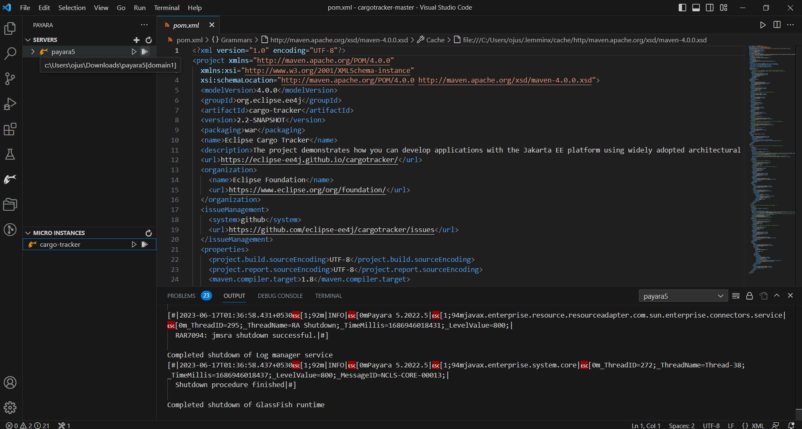

# Visual Studio Code

This section outlines how to set up the application in Visual Studio Code.

## Prerequisites

* Java SE 8, Java SE 11, or Java SE 17 is required. Please make sure that you have properly set up the JAVA_HOME environment variable.
* Payara Server 5 is required. You can download Payara Server 5 from [here](https://mvnrepository.com/artifact/fish.payara.distributions/payara).
* Visual Studio Code is required. You can download Visual Studio Code from [here](https://code.visualstudio.com/download).
* Ensure that the Visual Studio Code [Extension Pack for Java](https://marketplace.visualstudio.com/items?itemName=vscjava.vscode-java-pack) is installed.

## Download

[Download](https://github.com/eclipse-ee4j/cargotracker/archive/master.zip) the source code zip file and expand it somewhere in your file system. Note that this is a Maven project.

## Visual Studio Code Setup

Start Visual Studio Code. Go to -> Extensions (Ctrl+Shift+X). Search for [Payara Tools](https://marketplace.visualstudio.com/items?itemName=Payara.payara-vscode). Install Payara Tools.

 

Once the Payara Tools plugin is installed, click on the Payara icon on the left side bar below the Extensions icon, then click on the '+' icon on the Servers. Choose 'Local Domain' -> 'Browse the Payara Server', then select the directory where you installed Payara 5.

3. Name it Payara5 and hit next. Select default domain1.

4. Now ,a payara5 name icon with the Payara logo comes under the servers.Right-click on that icon,and select start,it will automatically start the Payara 5.

5. A small green color triangle comes under the Payara5 logo in the servers,this means your Payara server has been successfully started.You can verify if you wanted by visiting localhost:8080

### Importing Code

1. Go to File -> Open Folder ->Select the root directory of the Cargo Tracker project in your file system, and Hit finish.Visual Studio Code will automaticallyntify it as a Maven project.

2. This will take a few minutes to import the project for the first time.

### Building and Running on Payara 5
1. After the project loads,Go under the maven tab on the left bottom side,the eclipse cargo tracker name will be shown.Right-click on it and proceed with run maven commands clean and package(which will take a while the very first time as Maven downloads dependencies)

2. After this a war file of the name cargo-tracker.war will be built under the target section.

3. Right-click on that war file,select run on Payara server option

4. The first-time startup might take a bit of time. After this, Visual Studio Code will automatically open up a default browser window with the application. 

There is a tracking interface to track the current status of cargo and a booking interface to book and route cargo. You should explore both interfaces before diving into the code. You should also check out the [REST](https://github.com/eclipse-ee4j/cargotracker/blob/master/src/main/java/org/eclipse/cargotracker/interfaces/handling/rest/HandlingReportService.java) and [file processing](https://github.com/eclipse-ee4j/cargotracker/blob/master/src/main/java/org/eclipse/cargotracker/interfaces/handling/file/UploadDirectoryScanner.java) interfaces to register handling events as well as the mobile web interface. You can test against the REST interfaces using our [soapUI tests](https://github.com/eclipse-ee4j/cargotracker/tree/master/src/test/soapui).

### Stopping Cargo-tracker

* Click on the 'x' icon to stop the cargo-tracker application on Payara5.

