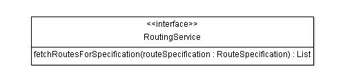

# Characterization

Careful characterization of classes is a key activity when doing Domain-Driven Design. Fortunately, most of the time it is fairly obvious what category a particular class belongs to. Other times it is not as easy to sort out and careful analysis, team collaboration and refactoring is necessary.

The trickiest ones to classify are typically Entities, Aggregates, Value Objects and Domain Events. When possible, you should favor Value Objects over Entities or Domain Events, because they require less attention during implementation. Value Objects can be created and thrown away at will, and since they are immutable we can pass them around as we wish. We must be much less cavalier with Entities as identity and life-cycle have to be carefully managed.

Below is a short walk-through of key classes in the application and the motivation behind their implementation choice.

## Entities

[Cargo](https://github.com/m-reza-rahman/cargo-tracker/blob/master/src/main/java/net/java/cargotracker/domain/model/cargo/Cargo.java) has both a clear identity and a life-cycle with state transitions that we care about, so it's an entity. It is obviously a key concept in the domain. Many cargo instances will exist in the system simultaneously. The different instances may have the same origin and destination, they may even contain the same kind of things, but it is important for us to be able to track individual cargo instances. In our case the cargo's identity is its tracking id. The tracking id is assigned upon creation and is never changed. This is the handle used to track the cargo's progress \(e.g. from the tracking website\).

The cargo's delivery state will change during it's lifetime. It's transport status will start out as NOT\_RECEIVED, i.e. booked but not yet handed over to the shipping company at the port, and in the normal case ends its life as CLAIMED \(note that this is a property of the cargo's [Delivery](https://github.com/m-reza-rahman/cargo-tracker/blob/master/src/main/java/net/java/cargotracker/domain/model/cargo/Delivery.java)\), tracking the current state the cargo. During a cargo's lifetime it may be assigned new destinations, its itinerary may be changed many times and it's delivery will be recalculated as new [HandlingEvents](https://github.com/m-reza-rahman/cargo-tracker/blob/master/src/main/java/net/java/cargotracker/domain/model/handling/HandlingEvent.java) are received.

A [Voyage](https://github.com/m-reza-rahman/cargo-tracker/blob/master/src/main/java/net/java/cargotracker/domain/model/voyage/Voyage.java) is a vessel's trip from origin to destination, typically made up of several segments \([CarrierMovements](https://github.com/m-reza-rahman/cargo-tracker/blob/master/src/main/java/net/java/cargotracker/domain/model/voyage/CarrierMovement.java)\). In the application a [Voyage](https://github.com/m-reza-rahman/cargo-tracker/blob/master/src/main/java/net/java/cargotracker/domain/model/voyage/Voyage.java) consists of a [Schedule](https://github.com/m-reza-rahman/cargo-tracker/blob/master/src/main/java/net/java/cargotracker/domain/model/voyage/Schedule.java) with the different [CarrierMovements](https://github.com/m-reza-rahman/cargo-tracker/blob/master/src/main/java/net/java/cargotracker/domain/model/voyage/CarrierMovement.java) in it and has a very clear notion of identity, [VoyageNumber](https://github.com/m-reza-rahman/cargo-tracker/blob/master/src/main/java/net/java/cargotracker/domain/model/voyage/VoyageNumber.java). This id could be something like a flight number for air shipments or a vessel voyage number for a ship, it is not the name or the identification of the actual vessel.

Unsurprisingly, domain entities are usually implemented as JPA entities. Note however, that sometimes it is necessary or convenient to implement value objects as JPA entities as well.

## Value Objects

A [Leg](https://github.com/m-reza-rahman/cargo-tracker/blob/master/src/main/java/net/java/cargotracker/domain/model/cargo/Leg.java) consists of a starting point and an ending point \(to [Location](https://github.com/m-reza-rahman/cargo-tracker/blob/master/src/main/java/net/java/cargotracker/domain/model/location/Location.java) and from [Location](https://github.com/m-reza-rahman/cargo-tracker/blob/master/src/main/java/net/java/cargotracker/domain/model/location/Location.java)\), and a reference to a voyage. A leg has no sense of identity; two legs with the same from location, end location and voyage are in our model completely interchangeable. As a result, we implement leg as an immutable Value Object.

An [Itinerary](https://github.com/m-reza-rahman/cargo-tracker/blob/master/src/main/java/net/java/cargotracker/domain/model/cargo/Itinerary.java) consists of a list of legs, with the load location of the first leg in the list as the starting point of the itinerary and the unload location of the last leg as the final destination. The same reasoning applies to itineraries as to legs, they do not have identity and are implemented as Value Objects. Now, a cargo can certainly have its itinerary updated. One way to accomplish this would be to keep the original itinerary instance and update the legs in the itinerary's list, in this case the itinerary must be mutable and has to be implemented as an entity. With the itinerary as a Value Object, as in the case of our application model and implementation, updating it is a simple operation of acquiring a complete new itinerary from the [RoutingService](https://github.com/m-reza-rahman/cargo-tracker/blob/master/src/main/java/net/java/cargotracker/domain/service/RoutingService.java) and replacing the old one. Implementation of a cargo's itinerary management is much simplified by having the itinerary as a Value Object.

Value Objects are typically implemented as JPA embedded objects. However, it is sometimes useful and valid to implement them as JPA entities.

## Domain Events

Some things clearly have identity but no life-cycle, or an extremely limited life-cycle with just one state. We call these things Domain Events and they can be viewed as hybrid of Entities and Value Objects. In our application [HandlingEvent](https://github.com/m-reza-rahman/cargo-tracker/blob/master/src/main/java/net/java/cargotracker/domain/model/handling/HandlingEvent.java) is a Domain Event that represent a real-life event such as cargo being loaded or unloaded, customs cleared etc. They carry both a completion time and a registration time. The completion time is the time when the event occurred and the registration time is the time when the event was received by the system. The handling event id is composed of the cargo, voyage, completion time, location and type \(LOAD, UNLOAD etc\).

Domain Events are usually implemented as JPA entities.

## Aggregates

In real life most things are connected, directly or indirectly. Mimicking this approach when building large software systems tends to bring unnecessary complexity and poor performance. DDD provides tactics to help you sort these things out, aggregates being one of the most important ones. Aggregates help with decoupling of large structures by setting rules for relations between entities. An aggregate is essentially a very closely related set of entities and value objects. An aggregate root is a special kind of entity in the aggregate that controls external access to the set of closely related entities and value objects.

Cargo is the central aggregate in the application. The classes in the cargo aggregate are in the [net.java.cargotracker.domain.model.cargo](https://github.com/m-reza-rahman/cargo-tracker/tree/master/src/main/java/net/java/cargotracker/domain/model/cargo) package. Cargo is the aggregate root and the aggregate also contains the Value Objects delivery, itinerary, leg and a few more classes.

Handling is another important aggregate. It contains the handling events that are registered throughout a cargo's progress from NOT\_RECEIVED to CLAIMED. The handling events have a relation to the cargo for which the event belongs. This is allowed since cargo itself is an aggregate root.

The main reason for not making handling event part of the cargo aggregate is performance. Handling events are received from external parties and systems, e.g. warehouse management systems, port handling systems, that call our [HandlingReportService](https://github.com/m-reza-rahman/cargo-tracker/blob/master/src/main/java/net/java/cargotracker/interfaces/handling/rest/HandlingReportService.java) REST web service implementation. The number of events can be very high and it is important that our web service can dispatch the remote calls quickly. To be able to support this use case we need to handle the web service calls asynchronously, i.e. we do not want to load the big cargo structure synchronously for each received handling event. Since all relationships in an aggregate must be handled synchronously we put the handling event in an aggregate of its own and we are able processes the events quickly and at the same time eliminate lock contention in the system.

## Repositories

With the aggregates and their roots identified it is fairly trivial to identify the Repositories. Repositories retrieve and save aggregate roots from and to persistent storage. In our application there is one Repository per aggregate root. For example, the [CargoRepository](https://github.com/m-reza-rahman/cargo-tracker/blob/master/src/main/java/net/java/cargotracker/domain/model/cargo/CargoRepository.java) is responsible for finding and storing cargo aggregates. The finders return Cargo instances or lists of Cargo instances.

While Repository interfaces are part of the domain layer, their implementations are part of the infrastructure layer. For example the CargoRepository has JPA implementation in the infrastructure layer, [JpaCargoRepository](https://github.com/m-reza-rahman/cargo-tracker/blob/master/src/main/java/net/java/cargotracker/infrastructure/persistence/jpa/JpaCargoRepository.java).

Repositories in Java EE are typically implemented using JPA and CDI. The DeltaSpike Data module is particularly helpful in implementing repositories. 

## Factories

In some cases creating entities are not as trivial as simply calling the new operator. In such cases, you will want to encapsulate entity creation using Factories. In our application, [HandlingEventFactory](https://github.com/m-reza-rahman/cargo-tracker/blob/master/src/main/java/net/java/cargotracker/domain/model/handling/HandlingEventFactory.java) is used to create handling events.

Factories are typically implemented using CDI.

## Domain Services

Domain services encapsulate key domain concepts that just are not naturally modeled as things. However, domain service method arguments and the return values are usually domain classes. Sometimes only the service interface \(what the service does\) is part of the domain layer, but the implementation \(how the service does it\) is part of the infrastructure layer. This is analogous to how repository interfaces are part of the domain layer, but the JPA implementations are not.

A good example of that is the [RoutingService](https://github.com/m-reza-rahman/cargo-tracker/blob/master/src/main/java/net/java/cargotracker/domain/service/RoutingService.java), which provides access to the routing system and is used to find possible routes for a given specification. The implementation, [ExternalRoutingService](https://github.com/m-reza-rahman/cargo-tracker/blob/master/src/main/java/net/java/cargotracker/infrastructure/routing/ExternalRoutingService.java), communicates with another system and translates to/from an external API/data model in the infrastructure layer.

On the other hand, if the service can be implemented strictly using the domain layer, both the interface and the implementation could be part of the domain layer.

## Application Services

Application services represent the high level business operations for the system and constitute the application layer. They provide a high-level abstraction for clients to use when interacting with the domain. The [net.java.cargotracker.application](https://github.com/m-reza-rahman/cargo-tracker/tree/master/src/main/java/net/java/cargotracker/application) package container all the services for the application such as [BookingService](https://github.com/m-reza-rahman/cargo-tracker/blob/master/src/main/java/net/java/cargotracker/application/BookingService.java) and [HandlingEventService](https://github.com/m-reza-rahman/cargo-tracker/blob/master/src/main/java/net/java/cargotracker/application/HandlingEventService.java). The application services are a natural place to apply concerns such as pooling, transactions and security. This is why application services are typically implemented using EJB or transactional CDI beans.

In some situations, e.g. when dealing with graphs of lazy-loaded domain objects or when passing services' return values over network boundaries, the services are wrapped in facades. The facades handle ORM session management issues and/or convert the domain objects to more portable Data Transfer Objects that can be tailored to specific use cases. In that case, we consider the DTO-serializing facade part of the interfaces layer. See [BookingServiceFacade](https://github.com/m-reza-rahman/cargo-tracker/blob/master/src/main/java/net/java/cargotracker/interfaces/booking/facade/BookingServiceFacade.java) for an example.

