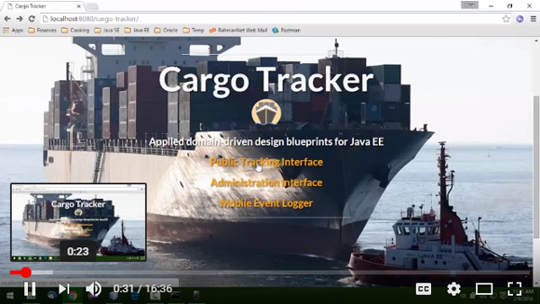

# Getting Started

## Screen Cast

Before exploring the code, it may be helpful to view a demo of the application functionality. The video below demos the major functionality of the Cargo Tracker application. It is intended to be a helpful point to start exploring how the application implements Domain-Driven Design \(DDD\) using Java EE.

The following is the functionality highlighted in the demo:

* Tracking cargo using the public interface.
* Monitoring cargo using both the static dashboard and live map.
* Booking and routing cargo.
* Registering cargo life-cycle events using the mobile interface.
* Registering cargo life-cycle events in bulk using the batch file processing interface.

## Exploring the Code

All of the code is available on GitHub. You can [download it as a zip](https://github.com/m-reza-rahman/cargo-tracker/archive/master.zip) or [browse the repository online](https://github.com/m-reza-rahman/cargo-tracker/).

## Running the Application

The project is Maven based, so you should be able to easily build it or set it up in your favorite IDE. We currently have [instructions for NetBeans](netbeans.md).

You can also run the application directly from the Maven command line using Apache Cargo. All you need to is navigate to the project source root and type:

`mvn package cargo:run`

Once the application starts up, just open up a browser and navigate to [http://localhost:8080/cargo-tracker/](http://localhost:8080/cargo-tracker/).

