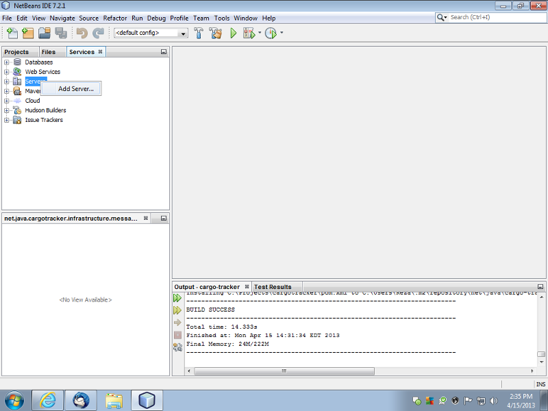
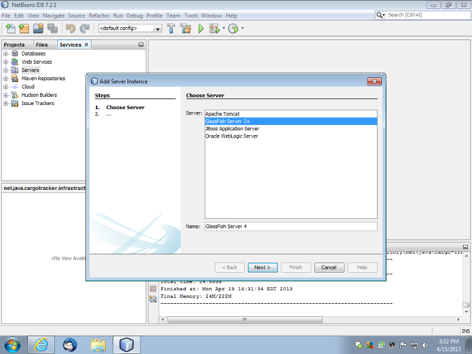
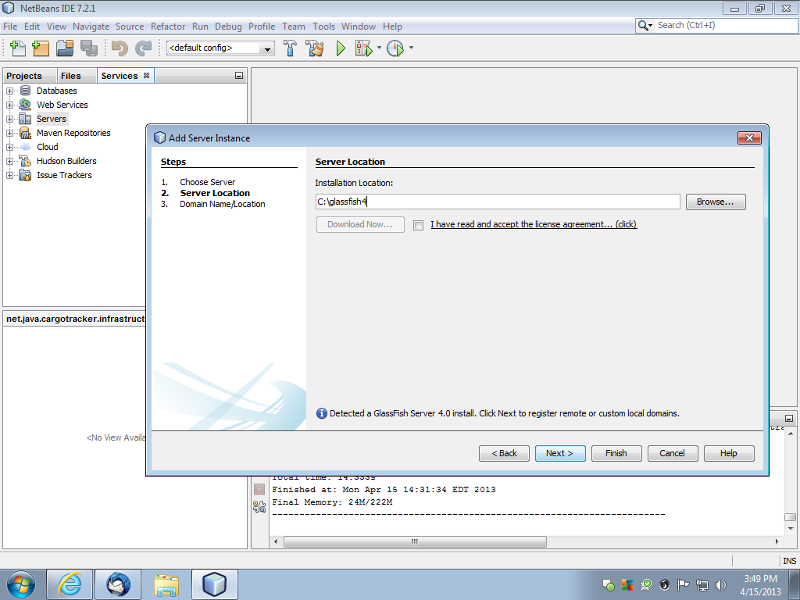
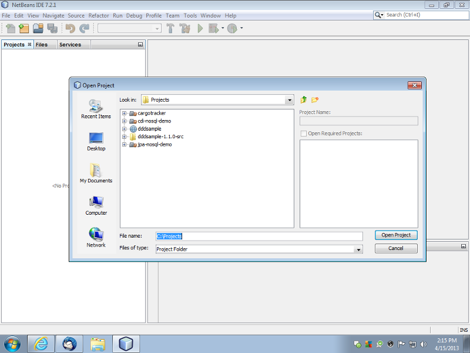
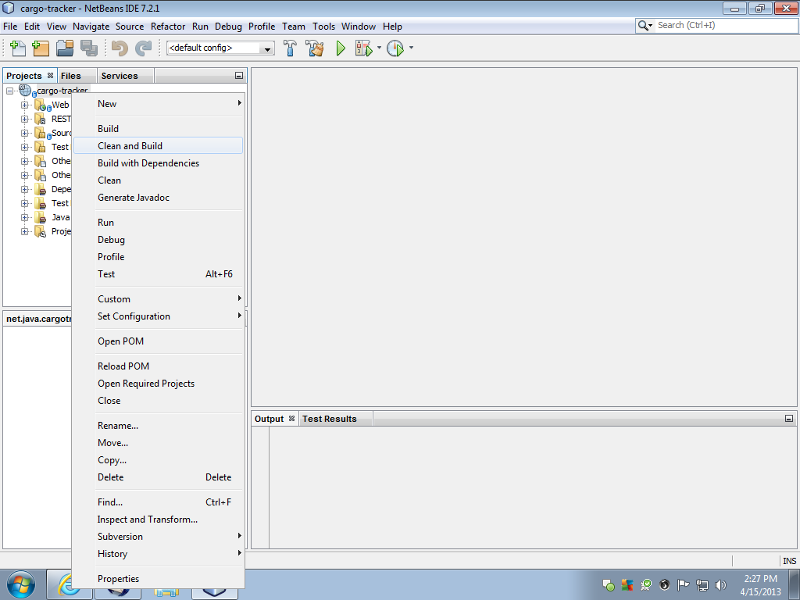
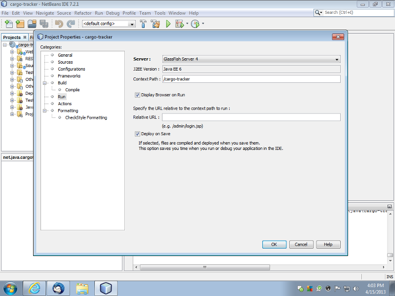
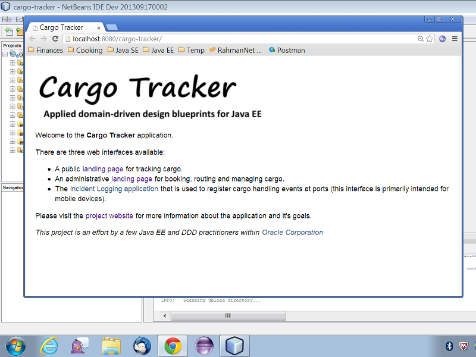

# NetBeans

This section outlines how to set up the application in NetBeans.

## Prerequisites

* JDK 8 or higher. You can download the JDK from [here](http://www.oracle.com/technetwork/java/javase/downloads/index.html).
* Payara Server 5 or higher You can download Payara Server from [here](https://www.payara.fish/downloads).
* NetBeans 8 or higher \(NetBeans 8.2 recommended\) - please make sure to use the Java EE edition of NetBeans. You can download NetBeans from [here](https://netbeans.org/downloads/).

## Download

[Download](https://github.com/m-reza-rahman/cargo-tracker/archive/master.zip) the source code zip file and expand it somewhere in your file system, ideally into _'/Projects'_. Note that this is a Maven project.

## NetBeans Setup

Start NetBeans, you will first need to configure Payara. Go in the _'Services'_ tab, right click _'Servers'_ and hit _'Add Server'_.

On the _'Add Server Instance'_ dialog, choose GlassFish and give the instance a sensible name. Hit _'Next'_.

Point the _'Installation Location'_ to where you have Payara installed on your file system \(typically the install is just the Payara download unzipped\). Hit _'Next'_. On the _'Domain Location'_ screen, accept the defaults and hit _'Finish'_.

Go to File-&gt;Open Project. Select the Cargo Tracker project from the file system and hit _'Open Project'_. NetBeans should recognize it as a Maven project on the file system. It may take a little bit to open and scan the project.

After the project opens, immediately build it \(you may be prompted to do a priming build, you can ignore the prompt\). This will automatically download all the Maven dependencies. To build, right click on the project and hit _'Clean and Build'_. It may take a little bit for the project to build.

After the project builds, you are now ready to run it.

You will now need to associate the Cargo Tracker project with Payara. To do this, right-click the project and select _'Properties'_. Then select _'Run'_. Select the Payara instance you just created as the _'Server'_, make sure the _'Context Path'_ is set to _'/cargo-tracker'_, accept the rest of the defaults and hit _'OK'_. It might take a bit to save the project data.

You are now ready to run the application. Right click on the project and hit _'Run'_. The first time startup might take a bit of time. After Payara starts, NetBeans should open up a browser window with the application.

There is a tracking interface to track the current status of cargo and a booking interface to book and route cargo. You should explore both interfaces before diving into the code. You should also check out the [REST](https://github.com/m-reza-rahman/cargo-tracker/blob/master/src/main/java/net/java/cargotracker/interfaces/handling/rest/HandlingReportService.java) and [file processing](https://github.com/m-reza-rahman/cargo-tracker/blob/master/src/main/java/net/java/cargotracker/interfaces/handling/file/UploadDirectoryScanner.java) interfaces to register handling events as well as the mobile web interface. You can test against the REST interfaces using our [soapUI tests](https://github.com/m-reza-rahman/cargo-tracker/tree/master/src/test/soapui).

