This section outlines how to set up the application in the VS CODE IDE.

## Prerequisites

* Java SE 8, Java SE 11 or Java SE 17 is required.
* Payara Server 5 is required. You can download Payara Server 5 from [here](https://www.payara.fish/downloads/).
* The VS CODE IDE is required. You can download the VS CODE from [here](https://code.visualstudio.com/download).

## Download

[Download](https://github.com/eclipse-ee4j/cargotracker/archive/master.zip) the source code zip file and expand it somewhere in your file system. Note that this is a Maven project.

## VSCODE IDE Setup

Before going through this tutorial, you must install the following extensions from the Visual Studio Code marketplace:

* [Java Extension Pack, by Microsoft](https://marketplace.visualstudio.com/items?itemName=vscjava.vscode-java-pack)
* [Payara Tools, by Payara](https://marketplace.visualstudio.com/items?itemName=Payara.payara-vscode)

You can install extensions from Extensions view (Ctrl + Shift + X) in the activity bar of VS Code:

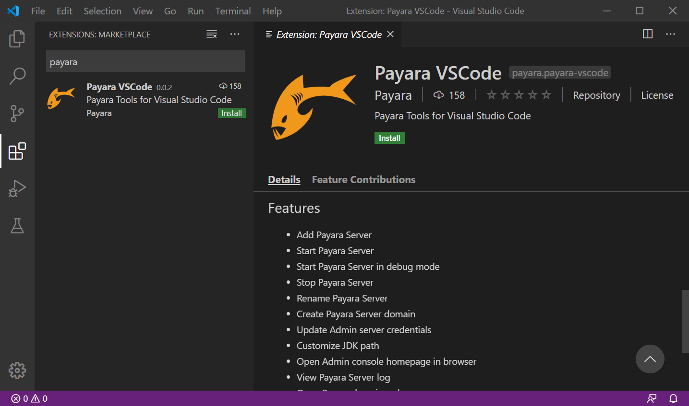
 
Let’s start:

 * Open the command pallet using Ctrl + Shift + P, type Maven and select the Create Maven Project option:

  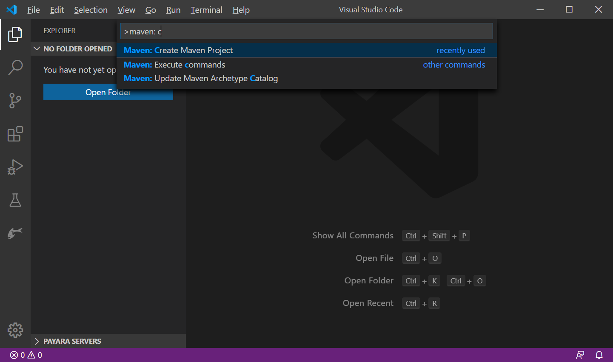

 * Or in the explorer sidebar expand Maven Projects, Select the + sign to create a Maven Project:

  

 * Select More… option to find archetype available in remote catalog:

  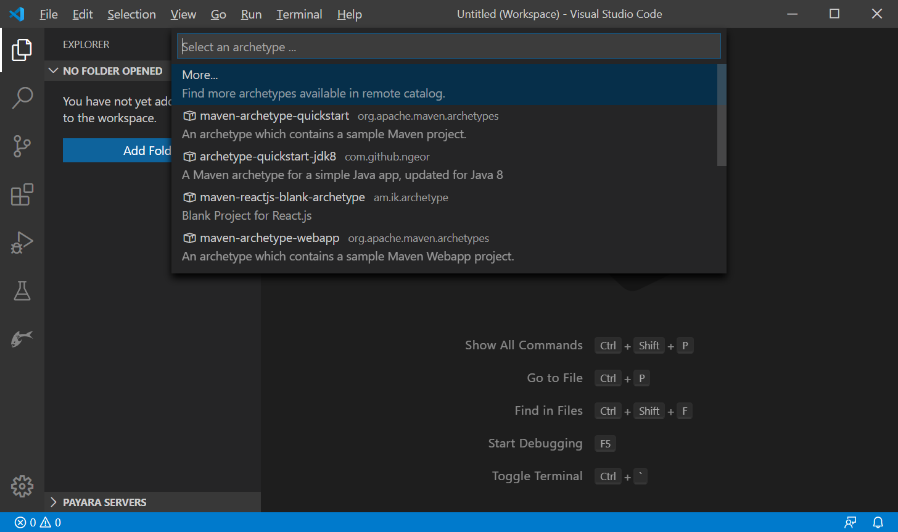

 * Search for the javaee8-essentials-archetype or you may select any other archetype:

  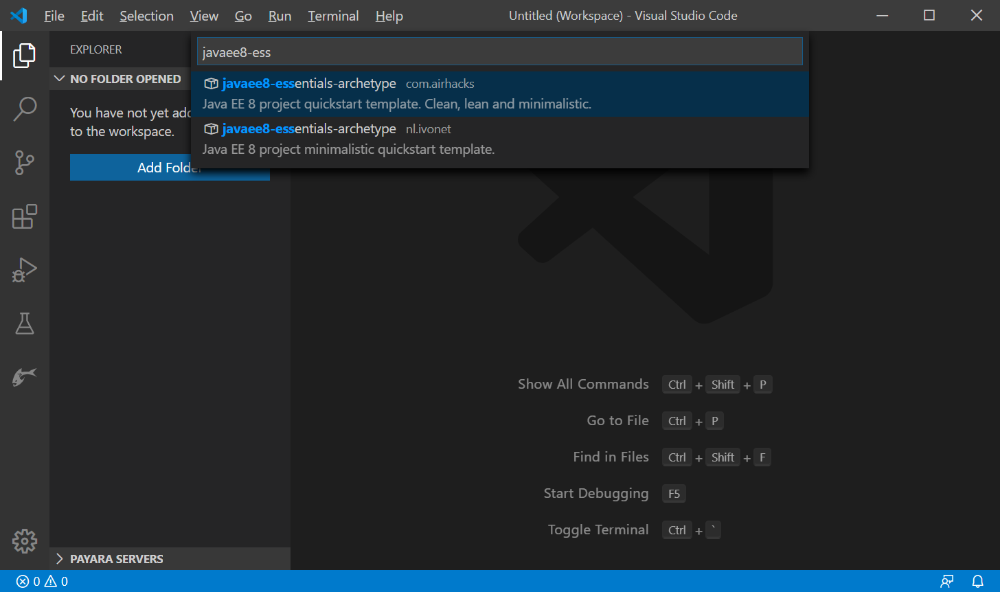

 * Select the destination folder, where the project folder will be generated and answer the prompts (groupId, artifactId, version etc) in the focused TERMINAL window to setup the maven project.

 * Open the Maven project folder in VS Code via File menu -> Open Folder… and select the CARGOTRACKER-MASTER project folder:

 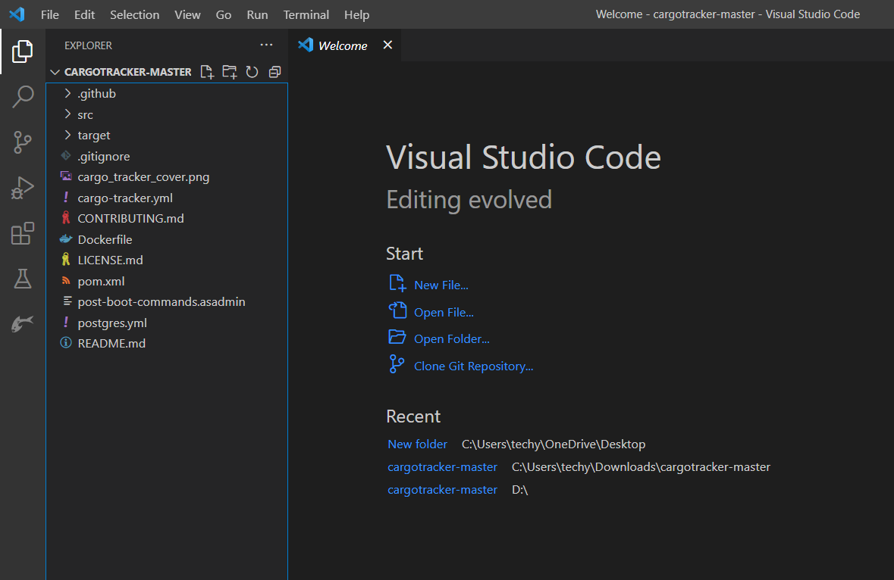

 ## Adding Payara Server
 
 * Open the command pallet using Ctrl + Shift + P, type Payara and select the Add Payara Server option:

 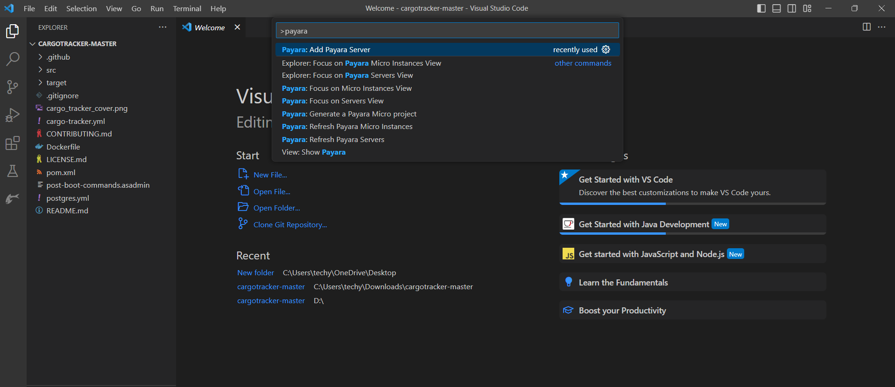

 * Or In the explorer sidebar (or Payara activity bar), expand Payara Servers, Select the + sign to add Payara Server:

 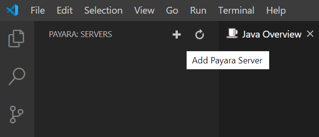

 * Select the location of your 'payara5' directory within the Payara Server installation:

 

 * Now name the server whatever you want. For this example I've named it 'Payara-Server-5.201'. Press Enter:

 

 * Finally, select a domain from the list or press the + sign to create the new domain:
 
 

 * Then, select the maven side-bar & righ-click to install:

 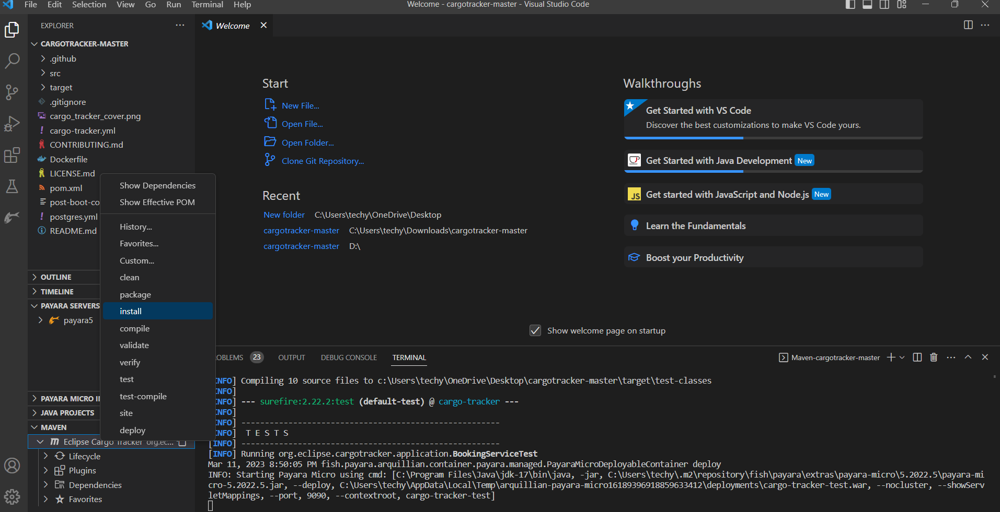

 * After Build success. To start the Payara Server right click on the server in Payara Server explorer and select Start:

 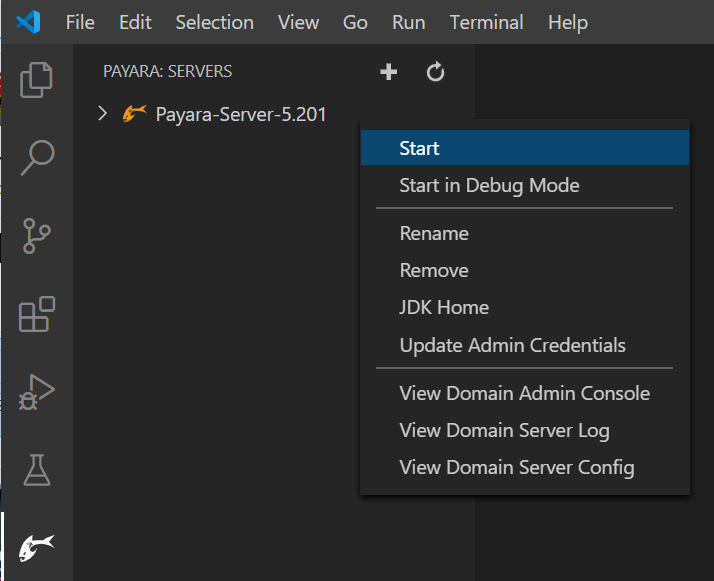

 ## Running the Payara Server Application

 * Now go to your project, and find the cargo-tracker.war file. Ther right click on it and select the Run on Payara Server option. The project will start and application will be deployed to Payara Server (Payara Server instance will be started if not running already):

 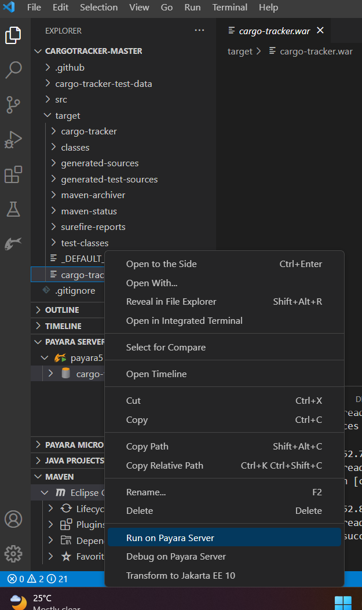

 * Now you should see a page (http://localhost:8080/cargo-tracker), eventually opened in your default browser.

 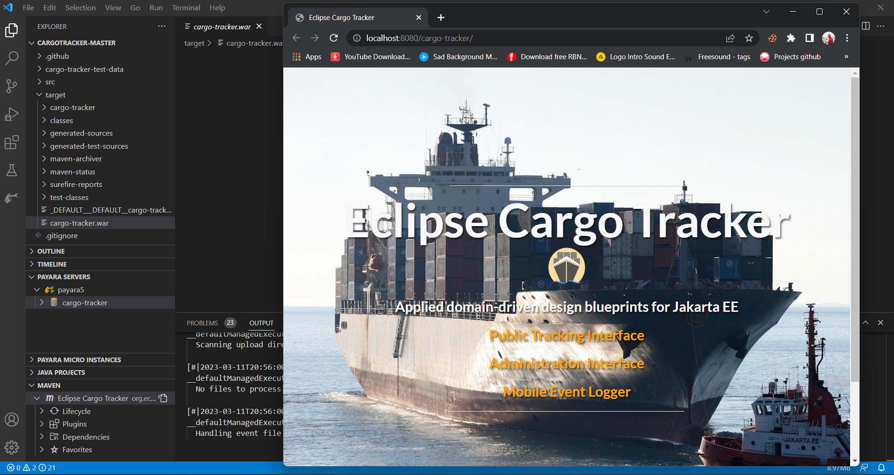

 
 

