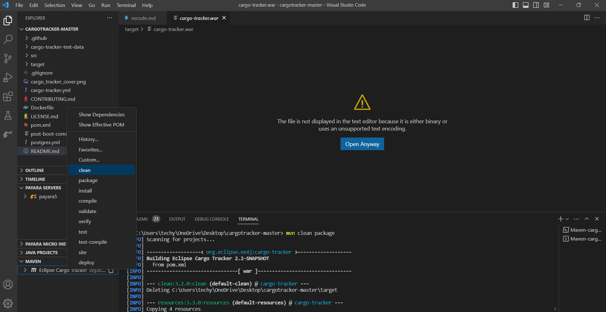

This section outlines how to set up the application in Visual Studio Code.

## Prerequisites

* Java SE 8, Java SE 11 or Java SE 17 is required.
* Payara Server 5 is required. You can download Payara Server 5 from [here](https://www.payara.fish/downloads/).
* The Visual Studio Code is required. You can download the Visual Studio Code from [here](https://code.visualstudio.com/download).
* You need to install this from Visual studio code marketplace [Java Extension Pack, by Microsoft](https://marketplace.visualstudio.com/items?itemName=vscjava.vscode-java-pack)

## Download

[Download](https://github.com/eclipse-ee4j/cargotracker/archive/master.zip) the source code zip file and expand it somewhere in your file system. Note that this is a Maven project.

## Visual Studio Code Setup

Start the Visual Studio Code, you will first need to add the Payara plugin:
* [Payara Tools, by Payara](https://marketplace.visualstudio.com/items?itemName=Payara.payara-vscode)
* Go to extension -> Visual studio code marketplace. Search for "Payara" and install Payara Tools.
  

 * Once the Payara plugin is installed, open the command pallet using Ctrl + Shift + P, type Maven and import Maven Project :

 * Now, open the Maven project folder in VS Code via File menu -> Open Folder… and select the CARGOTRACKER-MASTER project folder:
 
  

 ### Adding Payara Server

 * Open the command pallet using Ctrl + Shift + P, type Payara and select the Add Payara Server option:
 
  

 * Then select the location of your 'payara5' directory within the Payara Server installation:
 
   

 * Now name the server whatever you want. Press Enter.
 * Finally, select a domain from the list or press the + sign to create the new domain:
 
   

 * After creating the payara server, select the maven side-bar & right-click to clean the package:
 
   

 * After the project builds, you are now ready to run it. Now start the Payara Server, right- click on the server in Payara Server explorer and select Start:
 
   

 ### Running the Payara Server Application

 * Now go to your project, and find the cargo-tracker.war file in the generated target folder. Then right-click on it and select the Run on Payara Server option. The project will start, and the application will be deployed to Payara Server (the Payara Server instance will be started if not running already):
 
   
 
* The first time startup might take a bit of time. After Payara starts, the Visual studio code should open up a browser window with the application.

 * Now you should see a page (http://localhost:8080/cargo-tracker), eventually opened in your default browser.

   
 
There is a tracking interface to track the current status of cargo and a booking interface to book and route cargo. You should explore both interfaces before diving into the code.You should also check out the [REST](https://github.com/eclipse-ee4j/cargotracker/blob/master/src/main/java/org/eclipse/cargotracker/interfaces/handling/rest/HandlingReportService.java) and [file processing](https://github.com/eclipse-ee4j/cargotracker/blob/master/src/main/java/org/eclipse/cargotracker/interfaces/handling/file/UploadDirectoryScanner.java) interfaces to register handling events as well as the mobile web interface. You can test against the REST interfaces using our [soapUI tests](https://github.com/eclipse-ee4j/cargotracker/tree/master/src/test/soapui).
